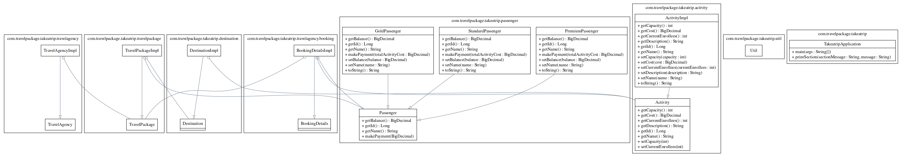

# Welcome to Take A Trip !

This Java / Maven based LLD project allows travel agencies to maintain their travel packages' itinerary and passengers.
This README provides an overview of the **Take A Trip LLD**, including its UML, Doc, technical considerations, and potential improvements.
<p align="center">
  
</p>

## Title

* [Requirements](#requirements)
* [How to run?](#how-to-run)
* [Java doc](#java-doc)
* [UML diagram](#uml-diagram)
* [About service & choices made](#about-service--choices-made)
* [Future improvements](#future-improvements)
* [Contact](#contact)

## Requirements

* Spring boot : version 3.2.0
* Maven : apache-maven-3.8.X
* Java : version 17

My configuration :

```
ankitver-mac:takeatrip ankitver$ mvn --version
Apache Maven 3.8.6 (84538c9988a25aec085021c365c560670ad80f63)
Maven home: /usr/local/Cellar/maven/3.8.6/libexec
Java version: 21, vendor: XXXX, runtime: /Library/Java/JavaVirtualMachines/jdk-21.jdk/Contents/Home
Default locale: en_IN, platform encoding: UTF-8
OS name: "mac os x", version: "13.5.1", arch: "x86_64", family: "mac"
```
```
ankitver-mac:takeatrip ankitver$ java -version
java version "21" 2023-09-19 LTS
Java(TM) SE Runtime Environment (build 21+35-LTS-2513)
Java HotSpot(TM) 64-Bit Server VM (build 21+35-LTS-2513, mixed mode, sharing)
```
## How to run?

1. Clone this repository
2. Install the required dependencies, generate doc, generate uml, run unit tests:  
	#### navigate to dir having *pom.xml* file and run
	```
	mvn clean install
	```
3. Once successfully built, you can run the service by one of these two methods:
	```
	mvn spring-boot:run 
    or
    Simple run TakeatripApplication main class
	```

## Java doc

It is generated when you do **mvn clean install**

Location: [target/apidocs](target/apidocs)

Click to view doc in browser: [https://htmlpreview.github.io/?https://github.com/mojo2jojo/tripmanager-lld/blob/main/target/apidocs/index.html](https://htmlpreview.github.io/?https://github.com/mojo2jojo/tripmanager-lld/blob/main/target/apidocs/index.html)

## UML diagram

It is generated when you do **mvn clean install**

Location of urm.dot file: [etc/takeatrip.urm.dot](etc/takeatrip.urm.dot)
Location of svg file: [uml.png](uml.png)



## About Service & choices made

* Service uses **lombok** to get basic functionality in a cleaner way.
* Used **maven** configuration to generate doc. 
* Used **maven** configuration to generate uml file (.urm.dot file). Used Graphviz interactive preview to view the file and get svg.
 
## Future Improvements

The project can be further improved in the following ways:

* Conduct thorough testing.
* Making code more modular. Breaking service functions into smaller units so that it is easy to test.
* Improving logging.
* Focus on making things rigid and complete before adding new functionality.

## Contact

For any questions or feedback, please contact Ankit Verma. Email: vermaav861997@gmail.com
